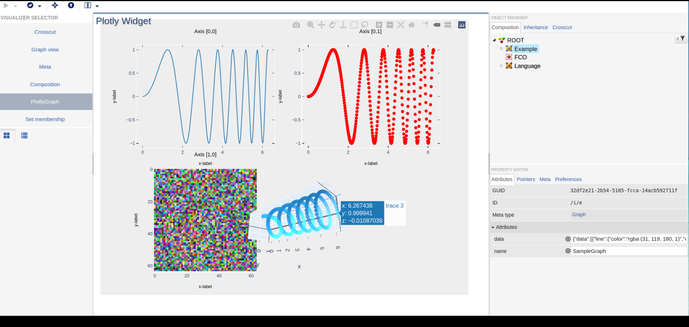

# webgme-plotly
## Installation
First, install the webgme-plotly following:
- [NodeJS](https://nodejs.org/en/) (LTS recommended)
- [MongoDB](https://www.mongodb.com/)

Second, start mongodb locally by running the `mongod` executable in your mongodb installation (you may need to create a `data` directory or set `--dbpath`).

Then, run `webgme start` from the project root to start . Finally, navigate to `http://localhost:8888` to start using webgme-plotly-viz!

## Plotly Visualizer For webgme
This repository contains implementations for visualizing [plotly](https://plotly.com/javascript/) JSON in webgme. 

### Usage
Checkout the following [seed](./src/seeds/testProject.webgmex), load it as a project and select `PlotlyGraph` panel
 for the sampleGraph node as shown in the figure below
 

 
### Customization
To use it in your own visualizer to visualize plotly JSON from your project nodes, use the following customization
 panel parameters. 
```
params = {
    plotlyDataAttribute: The active node attribute which stores plotly JSON
    embedded: If true, the visualizer will expect a parent visualizer to call "selectedObjectChanged". If false, it will subscribe to WebGME events.
}
```
 
 ```javascript
PlotlyGraphPanel.apply(
    this,
    [layoutManager, params]
);
```
 
